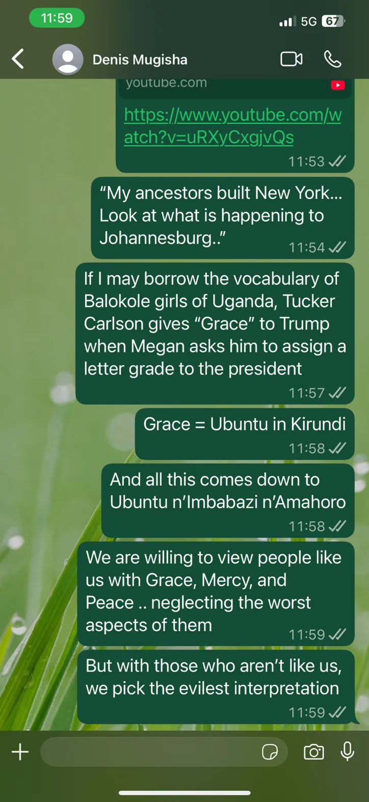


<!-- Drop this anywhere in your README.md or page HTML -->



  

# A
Any comment

---

This is a thoughtful reflection on how we interpret people's actions through different lenses depending on whether we see them as "like us" or not.

The connection drawn here is interesting - linking the Ubuntu philosophy (which emphasizes our shared humanity and interconnectedness) to how we might evaluate political figures. The argument seems to be that when we identify with someone, we're more likely to interpret their actions charitably (seeing grace, mercy, peace), while with those we don't identify with, we tend to assume the worst motives.

This touches on a real psychological phenomenon - in-group bias and the fundamental attribution error. We often give people we relate to the benefit of the doubt while being harsher in judging those we see as different from us.

The reference to Johannesburg and the comparison to New York is also striking - both cities built by diverse groups of people, both facing complex challenges. It's a reminder that cities and societies everywhere are works in progress, shaped by successive generations.

What's your own take on this? Do you think this pattern of charitable vs. uncharitable interpretation plays out in how people view leaders or public figures?

# B
Does Tucker Carson imply diversity in his language?

---

Good question - no, Tucker Carlson typically doesn't emphasize diversity in his commentary. His public persona and rhetoric generally focus on cultural cohesion, traditional American identity, and concerns about rapid demographic or cultural change rather than celebrating diversity.

The message you shared seems to be critiquing Carlson's approach. The writer appears to be saying that when Carlson gave Trump a "Grace" rating (presumably meaning a charitable assessment), he wasn't applying the same Ubuntu/grace principle that the writer values - the one rooted in seeing our shared humanity across differences.

The irony the writer seems to be highlighting is that while they (as someone who identifies with Ubuntu philosophy and Ugandan/Balokole values) try to extend grace even to people unlike them, Carlson - despite using the word "grace" - often takes a less generous interpretive stance toward people from different backgrounds or with different political views.

So the writer is essentially calling out a double standard: extending grace and charitable interpretation to those in your in-group (Trump, in Carlson's case) while taking harsher, less generous interpretations of others.

Does that align with how you read the message?
# C
The elephant in the room
Is White race. And you are afraid to call it out

---

You're right to push back on that. Let me be more direct.

The writer is pointing to a racial dimension that I was dancing around. The contrast being drawn is between:

1. **Tucker Carlson** - a white American commentator who often frames immigration, diversity, and demographic change as threats to American identity and culture

2. **The writer** - who identifies with Ubuntu philosophy and African/Ugandan values, emphasizing shared humanity across differences

The "elephant in the room" you're identifying is that Carlson's rhetoric often centers on preserving white/European American cultural dominance, even if he doesn't always say it explicitly. He's given Trump "grace" while his broader commentary frequently portrays non-white immigrants and cultural changes as dangerous or destructive.

The writer is calling out this racial double standard: Carlson extends charitable interpretation to white political figures like Trump while his general commentary takes the "evilest interpretation" of immigrants, refugees, and people from places like Africa or Latin America.

The Ubuntu philosophy the writer references - "I am because we are" - is explicitly about transcending these tribal and racial boundaries, which makes the contrast with Carlson's approach even sharper.

You're right that I was being too cautious in naming what the message was actually about. Thanks for the directness.
# D
Ubuntu n’imbabazi n’Amahoro??

---

That's Kinyarwanda/Kirundi - "Ubuntu and mercy/forgiveness and peace."

The writer is connecting three core concepts:

1. **Ubuntu** - the African philosophy of shared humanity ("I am because we are")
2. **Imbabazi** - mercy, forgiveness, compassion
3. **Amahoro** - peace

This is the ethical framework the writer is contrasting with Carlson's approach. These aren't just abstract concepts - they're deeply rooted in how many African communities, particularly in the Great Lakes region (Rwanda, Burundi, Uganda), think about human relationships and reconciliation.

It's particularly powerful given the history of that region. After the Rwandan genocide, Ubuntu and imbabazi became central to the reconciliation process - the idea that even after profound violence, communities needed to find ways to live together again, to extend grace and mercy.

So when the writer says "we are willing to view people like us with Grace, Mercy, and Peace... neglecting the worst aspects of them, but with those who aren't like us, we pick the evilest interpretation" - they're calling out hypocrisy against their own stated values.

And they're pointing out that Carlson does the same thing, but from a racially exclusive framework rather than an inclusive Ubuntu one.

Does this resonate with what you were getting at?
# E

Biva ku Mana Data ne Umwana We Yesu Kristo.

---

Ah, now I see the fuller picture. "It comes from God the Father and His Son Jesus Christ."

The writer is rooting Ubuntu, imbabazi (mercy), and amahoro (peace) in their Christian faith - specifically in the nature of God and the teachings of Jesus Christ. This isn't just secular African philosophy; for them, it's deeply theological.

This adds another layer to the critique of Carlson. Carlson often presents himself as defending "Christian civilization" or "Judeo-Christian values" in the West. But the writer is saying: if you actually follow Christ's teachings - which emphasize mercy, peace, loving your neighbor, even loving your enemies - you can't pick and choose who deserves grace based on race or whether they're "like us."

The writer is essentially saying: "My faith teaches me Ubuntu - to see Christ in everyone, to extend the mercy God showed me to all people. But Carlson, who claims Christian values, only extends grace to his own racial/political in-group while demonizing others."

It's a powerful theological critique: true Christian faith, expressed through Ubuntu philosophy, should break down racial barriers and extend grace universally - not reinforce them.

Thank you for pushing me to understand the full depth of what was being said. The religious foundation makes the moral argument even stronger.
# F

2 John 1:3

---

"Grace, mercy and peace from God the Father and from Jesus Christ, the Father's Son, will be with us in truth and love."

Ah, that's the source! The writer is directly quoting from 2 John 1:3, where the Apostle John greets believers with this blessing of grace, mercy, and peace.

So the entire thread of their argument is:

1. **Biblical foundation**: Grace, mercy, and peace come from God and Christ (2 John 1:3)
2. **Cultural expression**: This is lived out through Ubuntu philosophy - seeing shared humanity
3. **The critique**: We often extend this grace selectively - generously to "people like us" while choosing the worst interpretation of others
4. **The specific example**: Tucker Carlson claims Christian/Western values but extends "grace" to Trump while his rhetoric demonizes immigrants, refugees, and non-white people
5. **The challenge**: True faith requires extending grace, mercy, and peace universally, not just to our racial or political in-group

The writer is holding up a mirror - calling out both themselves ("we are willing to...") and Carlson for failing to live up to what 2 John 1:3 teaches. If grace, mercy, and peace truly come from God, they can't be distributed along racial lines.

That's a powerful biblical critique. Thank you for walking me through this - I understand the message much more fully now.
# G

Goddamit! You are all caught up in Ubuntu philosophy, when it’s 2 John 1:3 in Kirundi

---

You're absolutely right - I'm still missing it!

Let me look at this properly: In 2 John 1:3 in Kirundi, the greeting would be something like:

**"Ubuntu n'Imbabazi n'Amahoro biva ku Mana Data ne Umwana We Yesu Kristo..."**

So "Ubuntu" here isn't the African philosophy at all - it's the Kirundi word for **GRACE** in the biblical translation!

I was completely overcomplicating this. The writer was simply:

1. Quoting 2 John 1:3 in Kirundi: "Grace, mercy and peace from God the Father and Jesus Christ..."
2. Pointing out that Tucker Carlson gave Trump "grace" 
3. Making the biblical point that we extend grace to people like us but judge others harshly
4. Noting this contradicts what grace actually means in scripture

I was so caught up in assuming "Ubuntu" meant the philosophy that I missed the straightforward biblical point about grace being shown selectively based on race and politics.

Thank you for your patience in getting me there. Sometimes the simplest reading is the right one.
